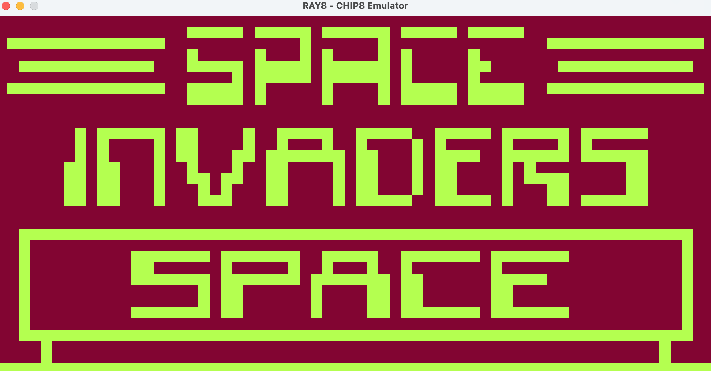
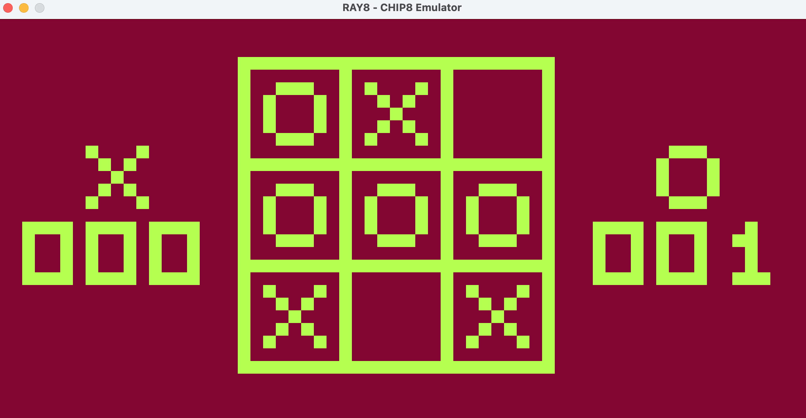
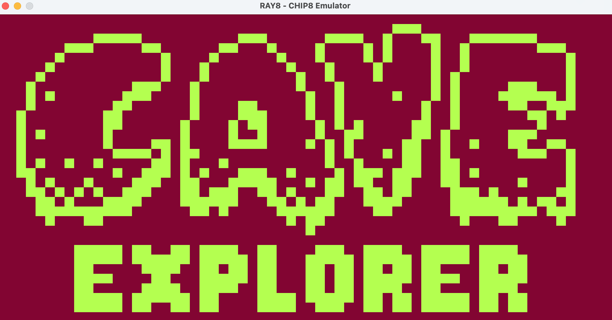
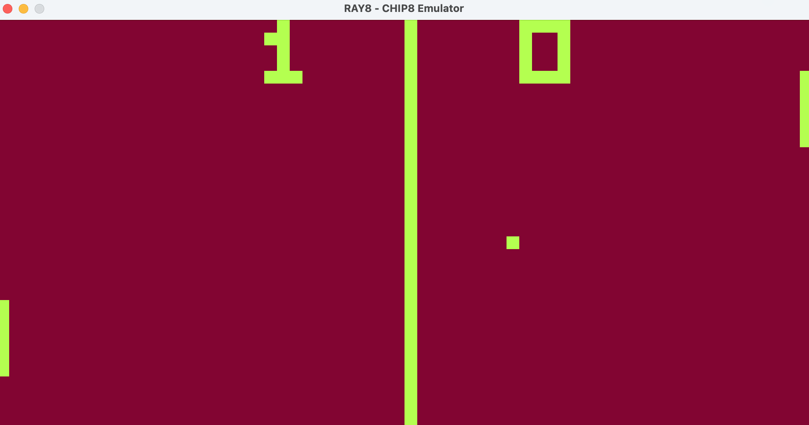
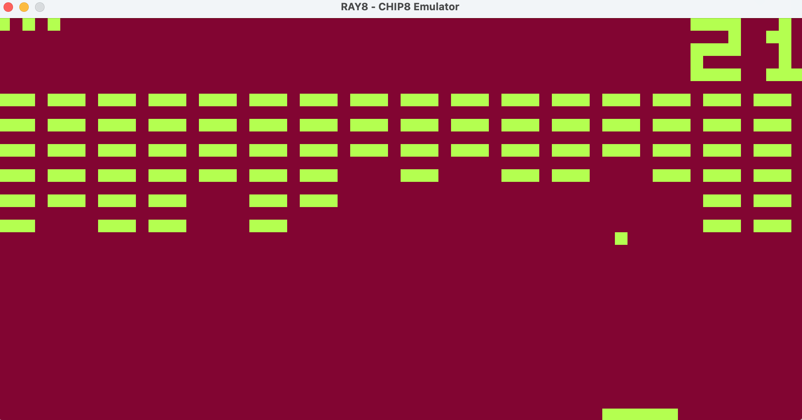

# CHIP-8 Emulator

A CHIP-8 emulator written in **C++** using **Raylib** for rendering. This project emulates classic CHIP-8 games with accurate instruction handling and display rendering.

## Screenshots

### Space Invaders



### Tic-tac-toe

  

### Cave Diver 

  

### Pong 2

  

### Brix 

  

## How to Build

### Prerequisites
Make sure you have:
- **CMake** installed  
- **Raylib** installed  
- A C++ compiler that supports C++11 or higher  

### Build Instructions
```sh
mkdir build
cd build

cmake ..

make

./emulator path/to/rom.ch8
```

## Usage

```sh
./emulator path/to/rom.ch8
```

## Keypad

| Chip 8 Key | Keyboard Key |
| :--------: | :----------: |
| `1`        | `1`          |
| `2`        | `2`          |
| `3`        | `3`          |
| `4`        | `Q`          |
| `5`        | `W`          |
| `6`        | `E`          |
| `7`        | `A`          |
| `8`        | `S`          |
| `9`        | `D`          |
| `0`        | `X`          |
| `A`        | `Z`          |
| `B`        | `C`          |
| `C`        | `4`          |
| `D`        | `R`          |
| `E`        | `F`          |
| `F`        | `V`          |

## TODO

- Add sound support
- Implement save states

## License

This project is open-source under the MIT License